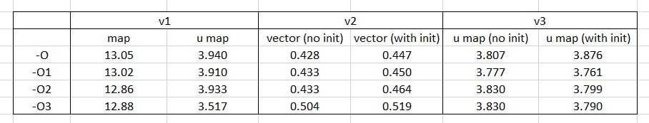

## Day 15

For day 15 I have benchmarked a few different version of the program used to find the answer. The benchmark timings are crudely collated using 3 averaged runs using various optimization levels. It is highly likely that optimization levels are irrelevant as the programs are not complicated and are more likely to be overoptimized. Nonetheless the results are shown below:

### Version 1

Version 1, day15.cpp, works by using a hash table (map or unordered_map) to store unique sequence terms as keys and the index of their last occurence as the corresponding value. Crutially, the map is not initialized and entries to the map are added as they occur. This leads to the most time consuming element to the method: searching the map for the current term. 

map::find (or unordered_map::find) is used to search the table for the existence of a key value pair before accessing or overwriting the value. This overhead adds the largest amount of work to the method. 

The usage of an ordered or unordered map is significant here as shown in the two columns under v1. Ordered maps suffer from much higher random access times and while the sequence under study follows some kind of order, it erraticaly moves from values of term[n]= n to 0. 

Using the unordered map, optimization levels seem to have little effect aside from '-O' which did somewhat reduce overall computation time.  

### Version 2

Version 2, day15v2.cpp, ended up being the fasting implemenation to answering the question. Rather than using hash tables, a vector of size up to the required term is initialized with all values equal to -1. As the sequence is processed, each term is used to change the value of vector[term] to its last occuring position. Hence the method could be somewhat more memory intensive due to requiring space for every number up to max size however the sequence is likely to require this anyway. 

Vector access times should suffer somewhat do to large size and random access requirements however this is not reflected in the benchmarks as it seems to handle this very well. Taking into account the initialization time of the vector, the program time does increase slightly however only by around 0.02s.

Again optimizations seemed to have little effect, probably due to the low complexity of the program. 

### Version 3

Version 3, day15v3.cpp, seemed promising due to the usage of unordered maps, optimizing random access times. A similar method is used as in version 2 where the maps is initialized to -1, with all possible term numbers from 0 to max term.

The initialization time varies according to method used. Using a for loop initialization of each member set to -1 takes about as long as an ordered map in version 1 (around 12s). Instead a struct, with member value = -1, can be used to initialized the map of type <int,struct> automatically. The former method suffers from much higher initialization time with faster sequence processing while the latter has a much faster initialization time but slower sequence processing. The benchmark above shows only results from the latter method which was always around 10 secons faster. 

I am not completely sure why this version, which employs a hash tables over a vector gives much lower calculation times. My current understanding of maps and their usage in C++ remains weak and there is likely significant optimizations possible to improve the simulation time of version 3. 

